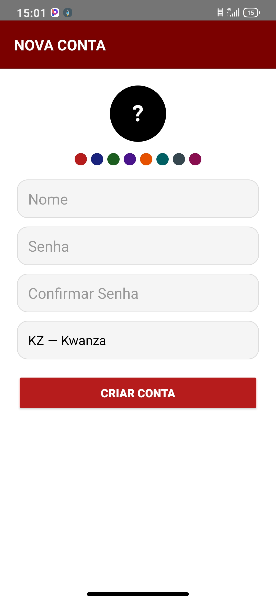
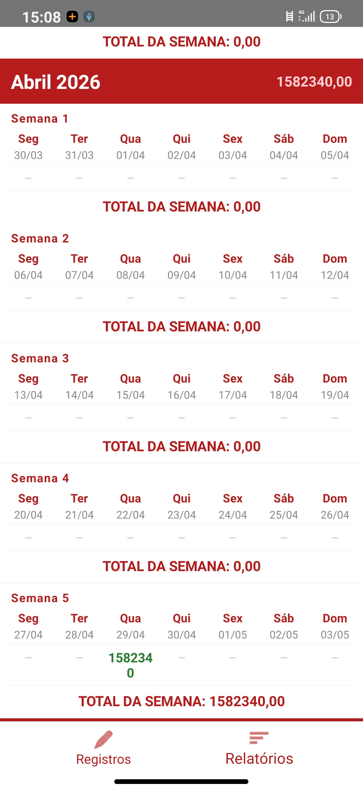
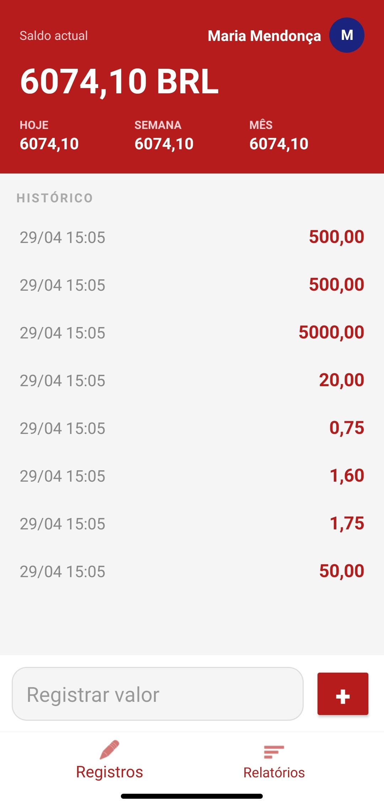
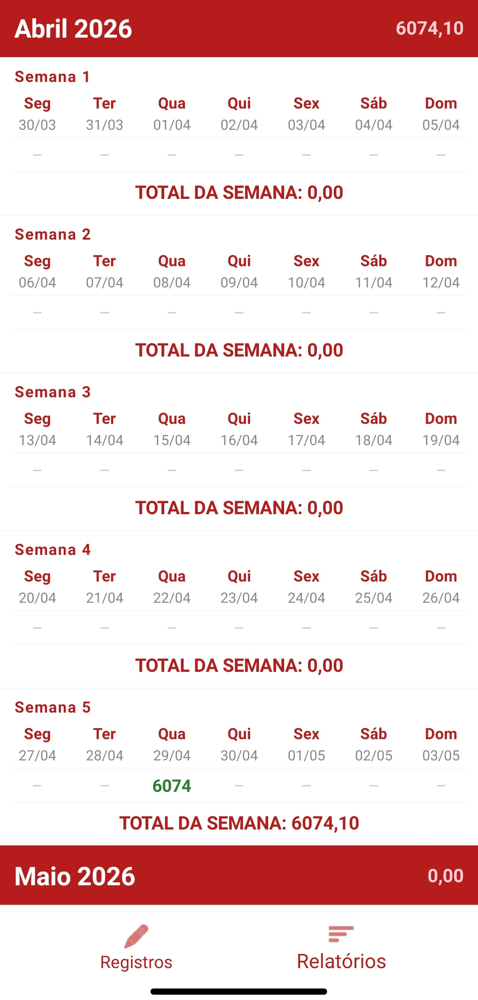
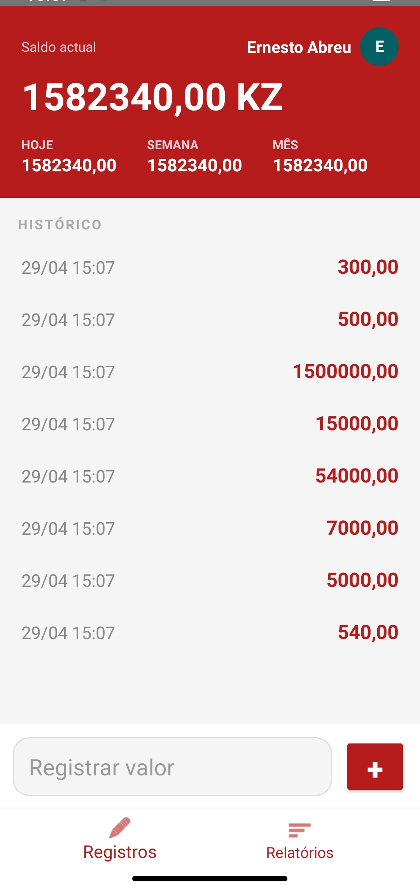
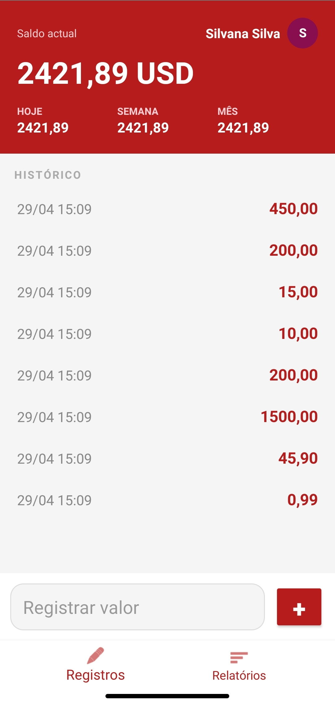
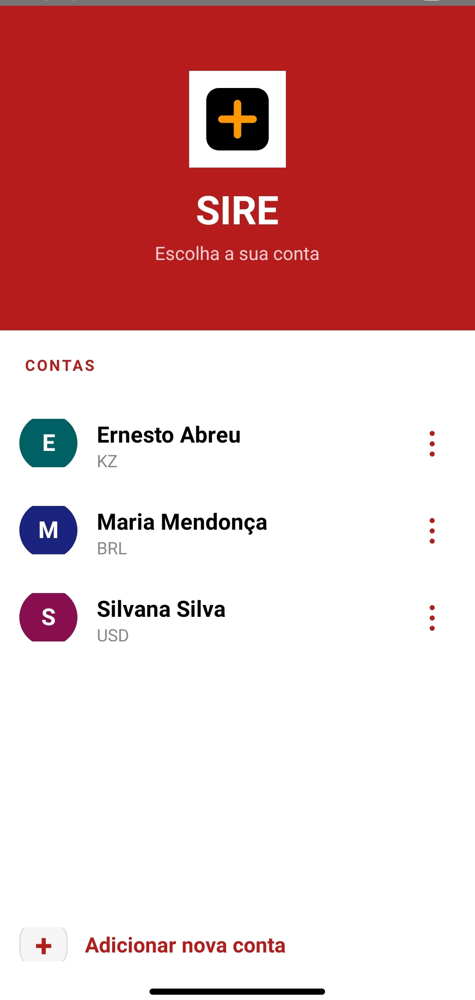

# SIRE - Sistema de Gestão Financeira

> O **SIRE** é uma aplicação excelente desenvolvida para a gestão de fluxos financeiros, configurada nativamente para **Kwanzas (KZ)**. Projetado com foco em performance e precisão, o sistema oferece uma interface intuitiva para o controlo de capital, ideal para utilizadores que necessitam de uma visão clara e imediata da sua saúde financeira.

---

##  Demonstração Visual

> **Interface Principal e Gestão de Registos**
> 

>   
>   
> 

> 
> **Fluxos de Trabalho e Monitorização**
> 

>   
>   
>   
> 

> 

>   
>   
> 

---

## Especificações Técnicas (MVP)

> A arquitetura do SIRE utiliza padrões modernos de engenharia de software para garantir fluidez mesmo em dispositivos com hardware limitado:
> 
> * **Motor de Persistência:** SQLite para armazenamento local otimizado através do `DatabaseHelper`.
> * **Arquitetura de UI:** Desenvolvido integralmente via código (**Dynamic UI Building**), utilizando `RecyclerView` com `ChatAdapter` para listagens dinâmicas.
> * **Lógica de Negócio:** Algoritmo proprietário para processamento de calendários e agrupamento de dados.
> * **Processamento Assíncrono:** Utilização de `WorkManager` para tarefas de segundo plano.

---

## Funcionalidades Chave

> * **Monitorização de Saldo:** Cálculo instantâneo de saldo atual, diário, semanal e mensal.
> * **Histórico de Transações:** Registo de entradas com *timestamp* preciso.
> * **Relatórios Inteligentes:** Grids que permitem identificar padrões de gastos e acumulação de capital.
> * **Localização Cambial:** Configurado nativamente para a moeda nacional angolana (KZ).

---

## Instalação e Atualização

> Para garantir a integridade do software, descarregue sempre a versão oficial através do nosso canal de distribuição:
> 
> 1.  Aceda ao link oficial de **[Releases](mailto:teuemail@exemplo.com)** (via e-mail).
> 2.  Descarregue o ficheiro `SIRE_v1.0.0.apk`.
> 3.  Execute o instalador no seu dispositivo Android.
> 4.  Certifique-se de que a opção **"Instalar de Fontes Desconhecidas"** está ativa.

---

## Propriedade Intelectual e Termos

> **O SIRE é um software proprietário.** Este repositório serve exclusivamente como canal oficial de distribuição do executável e documentação de utilização.
> 
> **Copyright © 2026 Adilson C. Rafael. Todos os direitos reservados.**
> 
> * **Restrições:** É estritamente proibida a engenharia reversa, descompilação ou qualquer tentativa de extração de lógica do binário.
> * **Uso:** Licença de uso individual e intransmissível.

---

### Contacto e Suporte
> Para questões técnicas, suporte imediato ou feedback sobre o MVP, utiliza os canais oficiais:
> 
> * **Comunidade:**  
> * **Conteúdo:**  
> * **Redes Sociais:**   
> * **Feedback:** [Reportar Bug via Issues](https://github.com/TEU_USUARIO/SIRE/issues)
